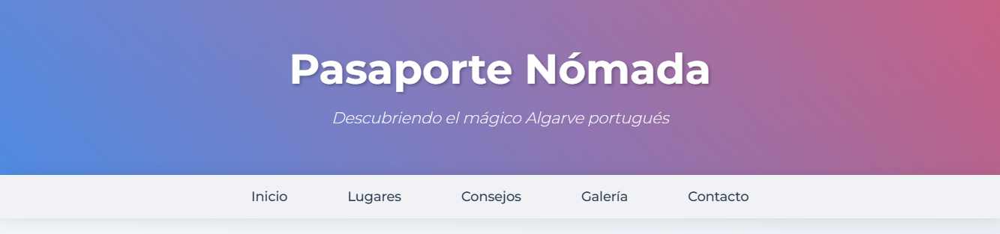
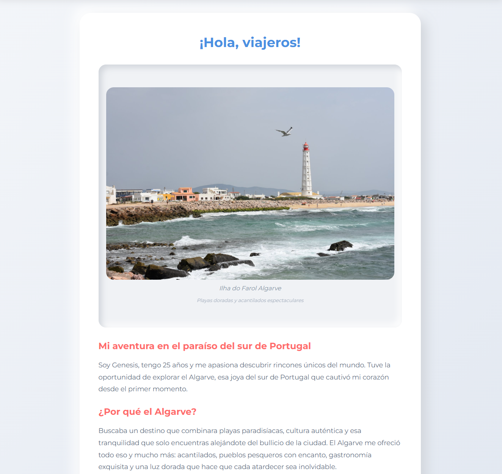
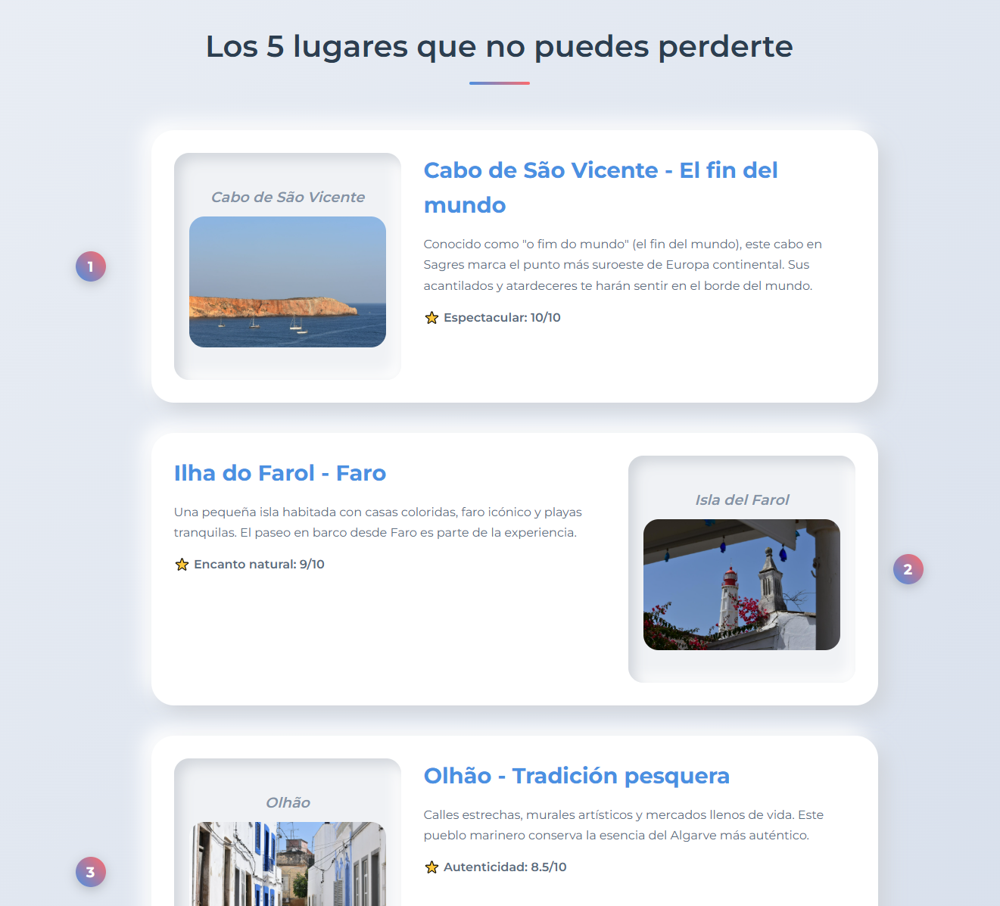
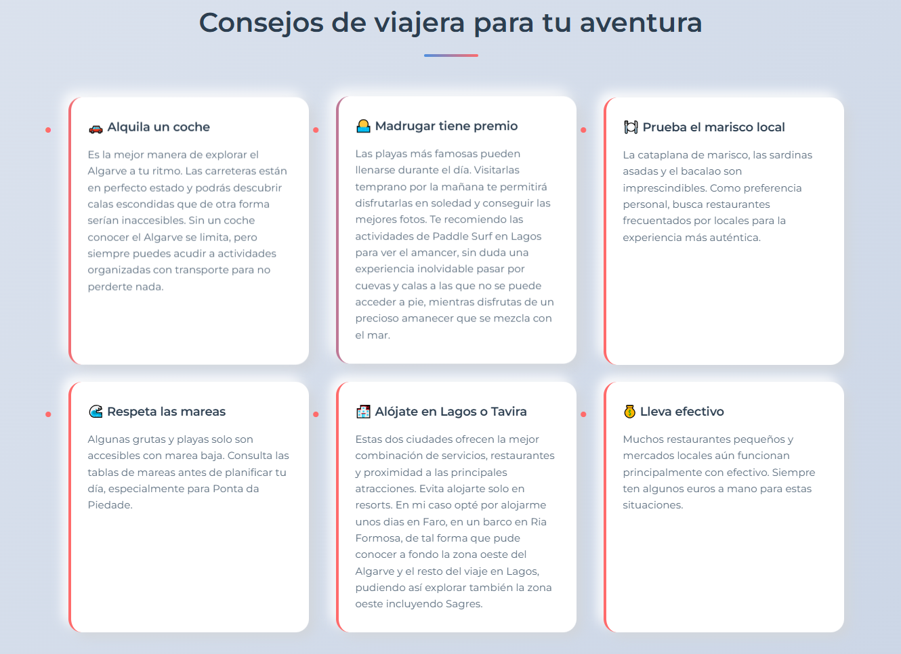
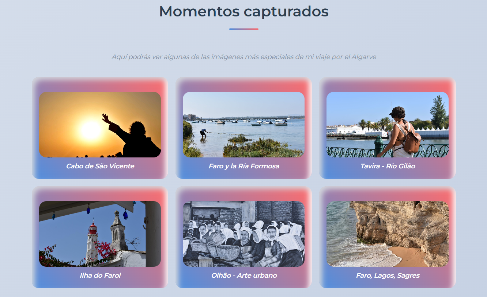
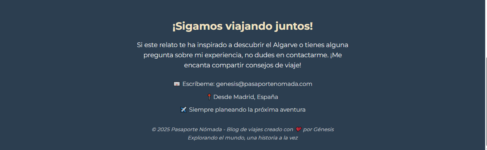

# 🌍 Pasaporte Nómada: Discovering the Portuguese Algarve

<p align="center">
  
  
  
  
  
</p>


<p align="center">  <br> <em>✨ A pastel-toned, fully handcrafted travel blog capturing the magic of southern Portugal ✨</em> </p> <p align="center"> <a href="https://github.com/genesisvaca/travel-blog-algarve-spanish/tree/main/media/preview"> 🔗 View All Previews </a> </p>

### 💡 Overview

**Pasaporte Nómada** is a static, fully responsive **travel blog** built entirely with **HTML, CSS, and JavaScript** — no frameworks, no libraries.
It’s designed to evoke calm and inspiration through a **neumorphic aesthetic**, **soft gradients**, and **original photography**, all captured and edited by the creator.

The blog is written in Spanish 🇪🇸 and invites readers to explore the **Algarve region of Portugal**, combining personal storytelling with thoughtful design and user interaction.

## 🌟 Key Features

- 🪶 Minimalist and pastel-inspired neumorphic design
- 🧭 Interactive sections with smooth transitions and hover effects
- 📸 Original photography taken by the author
- 💡 Sections include:
  - Introduction & personal travel story
  - Top 5 must-see places in the Algarve
  - Practical travel advice cards
  - Dynamic image carousel (location-based)
  - “Captured Moments” gallery
  - Contact & closing section
- 📱 Fully responsive layout for all devices

## 🖼️ Visual Highlights
<p align="center">   </p> <p align="center">   </p> <p align="center">   </p> <p align="center">  <br> <em>Each section blends narrative, color, and light for an immersive reading experience.</em> </p>

## 🧰 Technologies Used

| Technology               | Description                                               |
| ------------------------ | --------------------------------------------------------- |
| **HTML5**                | Semantic structure for a clear and accessible layout      |
| **CSS3**                 | Custom variables, neumorphism, and smooth transitions     |
| **JavaScript (Vanilla)** | DOM interactions, gallery navigation, and dynamic effects |


## ⚙️ Local Installation

### 1. Clone this repository
```
git clone https://github.com/genesisvaca/travel-blog-algarve-spanish.git
```

### 2. Open the project folder
```
cd travel-blog-algarve-spanish
```

### 3. Run locally

- Open `html/index.html` directly in your browser, or

- Use **Live Server** in VS Code for real-time preview.

## 🗳️ Project Structure
```
travel-blog-algarve-spanish/
├── css/
│   ├── styles.css           # Main styles
│   └── carousel.css         # Carousel design
├── html/
│   ├── index.html           # Main travel blog
│   └── carousel.html        # Image carousel (Captured Moments)
├── media/
│   ├── img/...              # Original images used in the site
│   └── preview/             # Page previews for README
│       ├── header_Index.PNG
│       ├── Inicio_Index.PNG
│       ├── Lugares_index.PNG
│       ├── Consejos_Index.PNG
│       ├── Gallery_Index.PNG
│       ├── Footer_Index.PNG
│       └── Galler_Preview.png
└── README.md

````
---
## ✉️ Contact

Created with ❤️ by **Génesis Vaca Palma**
📧 [genesisvacapalma@gmail.com](mailto:genesisvacapalma@gmail.com)  

📍 Based in Madrid, Spain  
🌐 [GitHub Profile](https://github.com/genesisvaca)


> *“Exploring the world”*
> 
> **— Pasaporte Nómada**
